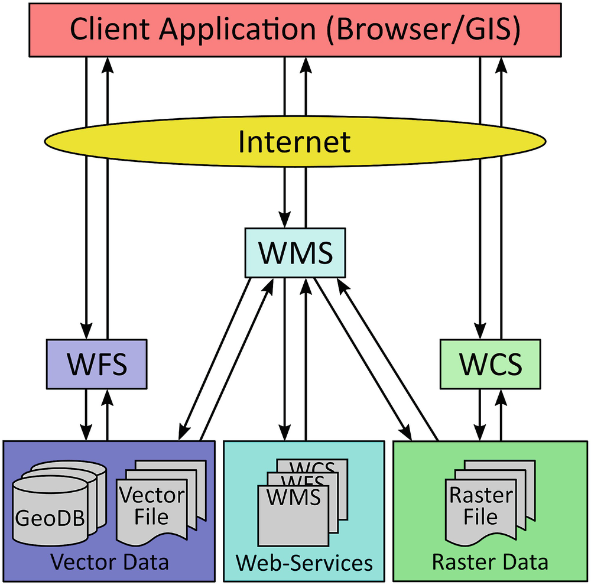

# Open Geospatial Consortium Standards

## What is the Web Feature Service (WFS)?

- Web Feature Service (WFS) is a standard created by the Open Geospatial Consortium (OGC) for creating, modifying, and exchanging vector format geographic information on the internet using HTTP.
   - A WFS encodes and transfers information in Geography Markup Language (GML), a subset of XML.

#### Overview

- Rather than sharing geographic information at the file level using FTP, WFS offers direct fine-grained access to geographic information at the feature and feature property level.
- The standard specifies discovery operations, query operations, locking operations, tranasction operations, and operations to manage stored, parameterized query expressions.

#### Reading

- [GeoServer WFS Reference](https://docs.geoserver.org/latest/en/user/services/wfs/reference.html)
- [OGC WFS Standards](https://www.ogc.org/standards/wfs/)



### Notes

- WFS is primarily a feature access services but also includes elements of a feature type service, a coordinate conversion/transformation service and geographic format conversion service.
- The WFS standard defines the framework for providing access to, and supporting transactions on, discrete geographic features in a manner that is independent of the underlying data source.
   - Through a combination of discovery, query, locking, and transaction operations, users have access to the source spatial and attribute data in a manner that allows them to interrogate, style, edit (CRUD), and download individual features.
      - The **transactional capabilities of WFS support the development and deployment of collaborative mapping applications**

(All versions of WFS support these)

 **Operations**
  - [x] _GetCapabilities_
      - [ ] Generates a metadata document describing a WFS service provided by server as well as valid WFS operations and parameters
  - [x] _DescribeFeatureType_
      - [ ] Returns a description of feature types supported by WFS service
  - [x] _GetFeature_
      - [ ] Returns a selection of features from a data source including geometry and attribute values
  - [x] _LockFeature_
      - [ ] Prevents a feature from being edited through a persistent feature lock
  - [x] _Transaction_
      - [ ] Edits existing feature types by creating, updating, and deleting

(version 2.0.0 only)
  - [x] _GetPropertyValue_
      - [ ] Retrieves the value of a feature property or part of the value of a complex feature property from the data store for a set of features identified using a query expression
  - [x] _GetFeatureWithLock_
      - [ ] Returns a selection of features and also applies a lock on those features
  - [x] _CreateStoredQuery_
     - [ ] Create a stored query on the WFS server
  - [x] _DropStoredQuery_
     - [ ] Deletes a stored query from the WFS server
  - [x] _ListStoredQueries_
     - [ ] Returns a list of the stored queries on a WFS server
  - [x] _DescribeStoredQueries_
     - [ ] Returns a metadata document describing the stored queries on a WFS server
(version 1.1.0 only)
  - [x] _GetGMLObject_
      - [ ] Retrieves features and elements by ID from a WFS


## What is the Geography Markup Language (GML)?

- The Geography Markup Language (GML) is an XML grammar for expressing geographical features. GML serves as a modeling language for geographic systems as an open interchange format for geographic transactions on the Internet.
-  Clients and servers with interfaces that implement the Web Feature Service Interface Standard read and write GML data.

#### Overview

- GML was to be a content-orient XML application completely separate from the area of how to display maps and others types of geospatial information on the web.
- OGC intended to create an unambiguous system of coding geographic information that would make possible the storage and the sharing of such information.
   - GML intended to avoid the problem of missing information for geographic documents, by using XML to specify mandatory information for a file by requiring all documents be validated by a parsing program.
- There are two parts to the XML-based grammar:
 1. the (GML) schema that describes the document
 2. the (GML) instance document that contains the actual data

_However, the developers of GML envision communities working to define community-specific application schemas that are specialized extensions of GML._

(e.g. CityGML, SensorML, IndoorML, O&M, GeoSciML,etc.)

For example, the GML standard can be used to encode dynamic features, spatial and temporal topology, complex geometric property types and coverages.

#### Reading

- [San Jose State University](https://www.sjsu.edu/faculty/watkins/gml.htm)
- [OGC GML Standards](https://www.ogc.org/standards/gml/)


### Notes

- The general scheme of GML is that a geographic document involves the specification of a set of features.
   - These features are described by properties, which may be of two types:

**GML is that a geographic document involves the specification of a set of features described by properties.**

 #### Simple Properties and Geometric Properties
 
 1. Simple properties are those that may be given by basic data forms: strings of characters (names), integers, real numbers or true/false (boolean) values.
 2. Geometric properties are created using **Points, LineStrings, and Polygons** with the special case of closed linearRings which are merely closed LineStrings. 

- Polygons are more than just LinearRings because there may be an interior boundary as well as an exterior boundary.
- In addition to these primitive geometric entities GML makes provision for sets (collections) of these elements: i.e., **MultiPoint, MultiLineString and MultiPolygon**. These are made up, as the names imply, of Points, LineStrings and Polygons. GML has another geometric element that can include geometric elements of any type. This is called a **GeometryCollection**.
- A **GeometryCollection** can also include other **GeometryCollections**.

 **How to define a feature collection in a GML application schema that complies with level SF-0 of this profile**
 ```
1 <element name="FeatureCollectionName"
2    type="[prefix:]FeatureCollectionNameType"
3    substitutionGroup="gml:AbstractGML"/>
4 <complexType name="FeatureCollectionNameType">
5    <complexContent>
6       <extension base="gml:AbstractFeatureType">
7          <sequence minOccurs="0" maxOccurs="unbounded">
8             <element name="featureMember">
9                <complexType>
10                   <complexContent>
11                      <extension base="gml:AbstractFeatureMemberType">
12                          <sequence>
13                            <element ref="gml:AbstractFeature"/>
14                          </sequence>
15                      </extension>
16                   </complexContent>
17                </complexType>
18             </element>
19          </sequence>
20       </extension>
21    </complexContent>
22 </complexType>
```

 **How to define a feature type in a GML application schema that complies with level SF-0 of this profile**

```
1 <xsd:element name="FeatureTypeName"
2    type="[prefix:]FeatureTypeNameType"
3    substitutionGroup="gml:AbstractFeature"/>
4
5 <xsd:complexType name="FeatureTypeNameType">
6    <xsd:complexContent>
7       <xsd:extension base="gml:AbstractFeatureType">
8          <xsd:sequence>
9
10          <!-- … zero or more element declarations as described in 8.4.4 … -->
11
12          </xsd:sequence>
13       </xsd:extension>
14    </xsd:complexContent>
15 </xsd:complexType>
```

**Basic Data Types**

In addition to the GML geometric property types defined in Table 6, this profile supports the following list of basic data types:

1. Integers (with optional specified value range and number of digits)
2. Measurements, that include a reference to units of measurement
3. Character strings (with optional specified maximum length or fixed length)
4. Date
5. Boolean
6. Binary data
7. URI references to local or remote resources
8. References to other resources
9. Character strings whose values are from a code list
10. Reals (with optional specified number of digits, decimal precision and value
range)

## What is the GeoPose?

- the OGC GeoPose Standard defines the encodings for the real world position and orientation of a real or a digital object in a machine-readable (JSON) format.
   - It provides a simple way to create a transformation matrix based on the **World Geodectic System (WGS84)** ellipsoid, to specify the position and the rotation of anything relative to the surface of the planet. Thus, facilitating the conversion between local, euclidean coordinates (X, Y, Z) amd global, geographic coordinates (longitude, latitude and altitude/height).

#### Overview

- Standard for exchanging location and orientation of real or virtual geometric objects, **Poses**, within reference frames anchored to the earth's surface, **Geo**, or within other astronomical coordinate systems.
- The standard specifies two **Basic forms** with no configuration options for common use cases, an **Advanced form** with more flexibility for more complex applications, and five composite GeoPose structures that support time series plus chain and graph structures. These _eight Standardization Targets are independent of each other_.
   - For each _Standardization Target_, each implementation technology and corresponding encoding format defines the encoding or serialization specified in a manner appropriate to that technology.


#### Reading

- [3D and (Geo)Spatially-anchored Collaboration on the Web with OGC GeoPose ](https://www.youtube.com/watch?v=F_TjgtvWpyA&t=287s)
- [OGC GeoPose Standards](https://www.ogc.org/standards/geopose/)

### Notes

- GeoPose 1.0 specifies a single-encoding in JSON format. Each Standardization Target has a JSON Schema encoding specification.
   - The key standardization requirements specify that concrete JSON-encoded GeoPose data objects must conform to the corresponding JSON schema definition.
- GeoPose 1.0 makes no assumptions about the interpretation of external specfications, for example, of reference frames. Nor does it assume or constrain services or interfaces providing conversion between GeoPoses of different types or relying on different external reference frame definitions.

**Critically, working with GeoPoses enables the definition of shared interaction spaces where multiple agents can share information in an interoperable way**

### Challenges Yet to Overcome

1. Low Accuracy

Currently, built-in (mobile-web) sensors have rather poor accuracy. Millimetric accuracy would require aided-positioning or Visual Positioning Systems.

2. Cybersecurity Risks

Sharing your physical position or photos with third parties poses significant privacy and security risks. 

3. Additional Computation


## What are the 3D Tiles?

- 3D Tiles is the open standard for massive, heterogeneous 3D geospatial datasets such as point clouds, buildings, and photogrammetry.
   - Built on glTF and other 3D data types, 3D tiles is a streamable, optimized format designed for sharing, visualizing, fusing, interacting with, and analyzing 3D geospatial content across desktop, web, and mobile applications.
      - 3D geospatial content, including photogrammetry models, BIM/CAD, 3D buildings, instanced features, and point clouds, can be converted into 3D Tiles and combined into a single dataset for seamless performance and real-time analytics including measurements, visibility analysis, styling and filtering.
         - The foundation of 3D Tiles is a spatial data structure that enables hierarchial level of detail so only visible tiles are streamed and rendered, improving overall performance.

### Overview
- A 3D Tiles data set, called a tileset, contains any combination of tile formats organized into a spatial data structure. 
- 3D Tiles are declarative, extendable, and applicable to various types of 3D dat.
- glTF 2.0 iss the primary tile format for the 3D tiles.
   - glTF is an open specification designed for the efficient transmission and loading of 3D content
      - a glTF asset includes geometry and texture information for a single tile, and may be extended to include metadata, model instancing, and compression.
   - There can be legacy 3D Tiles 1.0 tile formats specified as a Batched 3D Model, Instanced 3D Model, Point Cloud, Composite and more.

- Tiles are organized in a tree which incorporates the concept of Hierarchial Level of Detail (HLOD) for optimal rendering of spatial data.
   - Each tile has a bounding volume, an object defining a spatial extent completely enclosing it content.
      - The tree has spatial coherence; the content for child tiles are completely inside the parent's bounding volume.
   - A tileset may use a 2D spatial tiling scheme similar to raster and vector tiling schemes that serve predefined tiles at several levels of details or zoom levels, although the tree can be any spatial data structure with spatial coherence, including k-d trees, quadtrees, octrees, and grids.


#### Example View

- Tilesets, the core element of 3D Tiles, describes its hierarchial structure in JSON.

``` JSON
{
   "assets": { ... }
}
```
