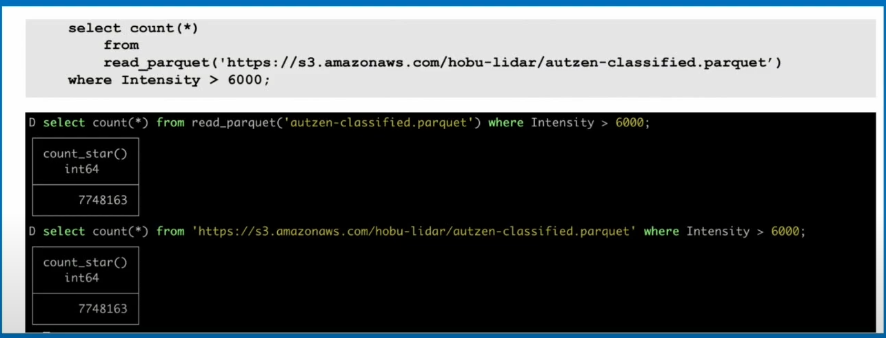

# PDAL

this is a point cloud data abstraction library. pronounced "poo-dal".

(about two release per year cycle)
[Releases](https://github.com/PDAL/python/releases/)

#### How to get PDAL

- from source
- from docker
- from lambda
- from conda
  - Linux / Windows / MacOS
  - x86 and arm

## Untwine

This is an alternative way of generating COPC data, it writes to disk and organizes there and light on memory usage unlike PDAL
d into QGIS 3.18 and greater is converted to COPC (unless it already has octree, EPT & COPC)
  - Untwine is used to convert to COPC, leverages disk space over memory, _gplv3_

## Virtual Pointclouds

- VPC uses STAC API ItemCollection
- Basically JSON files, a virtual collection of your point clouds.
- Lots of support for multi-threading

## State of PDAL, FOSS4GEE 2024

- Support for COPC, GeoArrow/Feather/Parquet, etc.
- COPC supports dimensions beyond the LAS point specification
- Multithreaded LAZ decompression
- Filter extended for Uber's H3, adding h3 spatial index as extra dimension
  - needs to be calculatable to geodectics
  - spatial queries without a spatial index
- Filter provide math support in expressions
- Directly GeoArrow/Feather/Parquet 1.0.0 readable locally or remote in DuckDB

  - Still some needs though? 
    - No _spatial indexing_, No _spatial hierarchy_
    - Storage does not correspond to hierarchy
    - Geometry storage is _well known binary_ (WKB), structs ala GeoArrrow
    - No row group metadata for predicate pushdowns
- Arbiter, built-in cloud access library
- Python API is separate (python-pdal)
- The stages of a PDAL [Pipeline] are divided into [Readers], [Filters] and [Writers].
- PDAL process data in one of two ways: *Standard Mode* or *Stream Mode*
  - Stream mode processes points through a pipeline in chunks, which reduces memory requirements.
- Readers provide [Dimensions](https://pdal.io/en/stable/dimensions.html#dimensions) to [Pipeline](https://pdal.io/en/stable/pipeline.html#pipeline)
- Writers consume data provided by Readers
- Filters operate on data as inline operations
