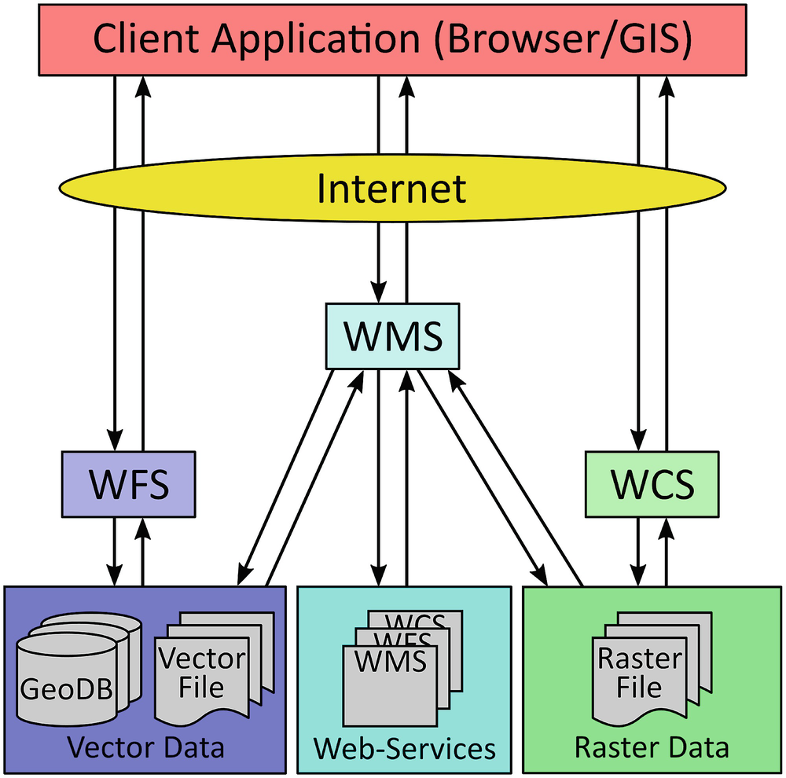
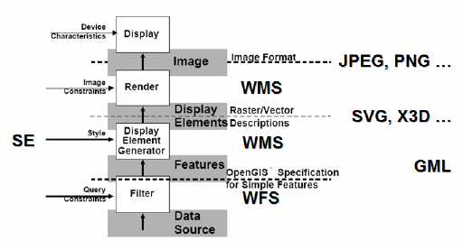

# Open Geospatial Consortium Standards

## What is the Web Feature Service (WFS)?

- Web Feature Service (WFS) is a standard created by the Open Geospatial Consortium (OGC) for creating, modifying, and exchanging vector format geographic information on the internet using HTTP.
   - A WFS encodes and transfers information in Geography Markup Language (GML), a subset of XML.

#### Overview

- Rather than sharing geographic information at the file level using FTP, WFS offers direct fine-grained access to geographic information at the feature and feature property level.
- The standard specifies discovery operations, query operations, locking operations, tranasction operations, and operations to manage stored, parameterized query expressions.

#### Reading

- [GeoServer WFS Reference](https://docs.geoserver.org/latest/en/user/services/wfs/reference.html)
- [OGC WFS Standards](https://www.ogc.org/standards/wfs/)



### Notes

- WFS is primarily a feature access services but also includes elements of a feature type service, a coordinate conversion/transformation service and geographic format conversion service.
- The WFS standard defines the framework for providing access to, and supporting transactions on, discrete geographic features in a manner that is independent of the underlying data source.
   - Through a combination of discovery, query, locking, and transaction operations, users have access to the source spatial and attribute data in a manner that allows them to interrogate, style, edit (CRUD), and download individual features.
      - The **transactional capabilities of WFS support the development and deployment of collaborative mapping applications**

(All versions of WFS support these)

 **Operations**
  - [x] _GetCapabilities_
      - [ ] Generates a metadata document describing a WFS service provided by server as well as valid WFS operations and parameters
  - [x] _DescribeFeatureType_
      - [ ] Returns a description of feature types supported by WFS service
  - [x] _GetFeature_
      - [ ] Returns a selection of features from a data source including geometry and attribute values
  - [x] _LockFeature_
      - [ ] Prevents a feature from being edited through a persistent feature lock
  - [x] _Transaction_
      - [ ] Edits existing feature types by creating, updating, and deleting

(version 2.0.0 only)
  - [x] _GetPropertyValue_
      - [ ] Retrieves the value of a feature property or part of the value of a complex feature property from the data store for a set of features identified using a query expression
  - [x] _GetFeatureWithLock_
      - [ ] Returns a selection of features and also applies a lock on those features
  - [x] _CreateStoredQuery_
     - [ ] Create a stored query on the WFS server
  - [x] _DropStoredQuery_
     - [ ] Deletes a stored query from the WFS server
  - [x] _ListStoredQueries_
     - [ ] Returns a list of the stored queries on a WFS server
  - [x] _DescribeStoredQueries_
     - [ ] Returns a metadata document describing the stored queries on a WFS server
(version 1.1.0 only)
  - [x] _GetGMLObject_
      - [ ] Retrieves features and elements by ID from a WFS


## What is the Geography Markup Language (GML)?

- The Geography Markup Language (GML) is an XML grammar for expressing geographical features. GML serves as a modeling language for geographic systems as an open interchange format for geographic transactions on the Internet.
-  Clients and servers with interfaces that implement the Web Feature Service Interface Standard read and write GML data.

#### Overview

- GML was to be a content-orient XML application completely separate from the area of how to display maps and others types of geospatial information on the web.
- OGC intended to create an unambiguous system of coding geographic information that would make possible the storage and the sharing of such information.
   - GML intended to avoid the problem of missing information for geographic documents, by using XML to specify mandatory information for a file by requiring all documents be validated by a parsing program.
- There are two parts to the XML-based grammar:
 1. the (GML) schema that describes the document
 2. the (GML) instance document that contains the actual data

_However, the developers of GML envision communities working to define community-specific application schemas that are specialized extensions of GML._

(e.g. CityGML, SensorML, IndoorML, O&M, GeoSciML,etc.)

For example, the GML standard can be used to encode dynamic features, spatial and temporal topology, complex geometric property types and coverages.

#### Reading

- [San Jose State University](https://www.sjsu.edu/faculty/watkins/gml.htm)
- [OGC GML Standards](https://www.ogc.org/standards/gml/)



### Notes

- The general scheme of GML is that a geographic document involves the specification of a set of features.
   - These features are described by properties, which may be of two types:

**GML is that a geographic document involves the specification of a set of features described by properties.**

 #### Simple Properties and Geometric Properties
 
 1. Simple properties are those that may be given by basic data forms: strings of characters (names), integers, real numbers or true/false (boolean) values.
 2. Geometric properties are created using **Points, LineStrings, and Polygons** with the special case of closed linearRings which are merely closed LineStrings. 

- Polygons are more than just LinearRings because there may be an interior boundary as well as an exterior boundary.
- In addition to these primitive geometric entities GML makes provision for sets (collections) of these elements: i.e., **MultiPoint, MultiLineString and MultiPolygon**. These are made up, as the names imply, of Points, LineStrings and Polygons. GML has another geometric element that can include geometric elements of any type. This is called a **GeometryCollection**.
- A **GeometryCollection** can also include other **GeometryCollections**.

 **How to define a feature collection in a GML application schema that complies with level SF-0 of this profile**
 ```
1 <element name="FeatureCollectionName"
2    type="[prefix:]FeatureCollectionNameType"
3    substitutionGroup="gml:AbstractGML"/>
4 <complexType name="FeatureCollectionNameType">
5    <complexContent>
6       <extension base="gml:AbstractFeatureType">
7          <sequence minOccurs="0" maxOccurs="unbounded">
8             <element name="featureMember">
9                <complexType>
10                   <complexContent>
11                      <extension base="gml:AbstractFeatureMemberType">
12                          <sequence>
13                            <element ref="gml:AbstractFeature"/>
14                          </sequence>
15                      </extension>
16                   </complexContent>
17                </complexType>
18             </element>
19          </sequence>
20       </extension>
21    </complexContent>
22 </complexType>
```

 **How to define a feature type in a GML application schema that complies with level SF-0 of this profile**

```
1 <xsd:element name="FeatureTypeName"
2    type="[prefix:]FeatureTypeNameType"
3    substitutionGroup="gml:AbstractFeature"/>
4
5 <xsd:complexType name="FeatureTypeNameType">
6    <xsd:complexContent>
7       <xsd:extension base="gml:AbstractFeatureType">
8          <xsd:sequence>
9
10          <!-- … zero or more element declarations as described in 8.4.4 … -->
11
12          </xsd:sequence>
13       </xsd:extension>
14    </xsd:complexContent>
15 </xsd:complexType>
```

**Basic Data Types**

In addition to the GML geometric property types defined in Table 6, this profile supports the following list of basic data types:

1. Integers (with optional specified value range and number of digits)
2. Measurements, that include a reference to units of measurement
3. Character strings (with optional specified maximum length or fixed length)
4. Date
5. Boolean
6. Binary data
7. URI references to local or remote resources
8. References to other resources
9. Character strings whose values are from a code list
10. Reals (with optional specified number of digits, decimal precision and value
range)

## What is the GeoPose?

- the OGC GeoPose Standard defines the encodings for the real world position and orientation of a real or a digital object in a machine-readable (JSON) format.
   - It provides a simple way to create a transformation matrix based on the **World Geodectic System (WGS84)** ellipsoid, to specify the position and the rotation of anything relative to the surface of the planet. Thus, facilitating the conversion between local, euclidean coordinates (X, Y, Z) amd global, geographic coordinates (longitude, latitude and altitude/height).

#### Overview

- Standard for exchanging location and orientation of real or virtual geometric objects, **Poses**, within reference frames anchored to the earth's surface, **Geo**, or within other astronomical coordinate systems.
- The standard specifies two **Basic forms** with no configuration options for common use cases, an **Advanced form** with more flexibility for more complex applications, and five composite GeoPose structures that support time series plus chain and graph structures. These _eight Standardization Targets are independent of each other_.
   - For each _Standardization Target_, each implementation technology and corresponding encoding format defines the encoding or serialization specified in a manner appropriate to that technology.
#### Reading

- [3D and (Geo)Spatially-anchored Collaboration on the Web with OGC GeoPose ](https://www.youtube.com/watch?v=F_TjgtvWpyA&t=287s)
- [OGC GeoPose Standards](https://www.ogc.org/standards/geopose/)

### Notes

- GeoPose 1.0 specifies a single-encoding in JSON format. Each Standardization Target has a JSON Schema encoding specification.
   - The key standardization requirements specify that concrete JSON-encoded GeoPose data objects must conform to the corresponding JSON schema definition.
- GeoPose 1.0 makes no assumptions about the interpretation of external specfications, for example, of reference frames. Nor does it assume or constrain services or interfaces providing conversion between GeoPoses of different types or relying on different external reference frame definitions.

**Critically, working with GeoPoses enables the definition of shared interaction spaces where multiple agents can share information in an interoperable way**

### Challenges Yet to Overcome

1. Low Accuracy

Currently, built-in (mobile-web) sensors have rather poor accuracy. Millimetric accuracy would require aided-positioning or Visual Positioning Systems.

2. Cybersecurity Risks

Sharing your physical position or photos with third parties poses significant privacy and security risks. 

3. Additional Computation

Translating geospatial coordinates into the transform matrices that 3D hardware operates with requires the use of trigonometric functions that are computationally expensive.


# 101 Geospatial Questions

 ## What is the most accurate method of measuring distance between two points on Earth?

### Reading
- [calculations for lati­tude/longi­tude points, with the formulas and code fragments for implementing them](https://www.movable-type.co.uk/scripts/latlong.html)
- [Vincenty solutions of geodesics on the ellipsoid](https://www.movable-type.co.uk/scripts/latlong-vincenty.html)
- [algorithms for the computation of geodesics on an ellipsoid of revolution are given](https://link.springer.com/article/10.1007/s00190-012-0578-z)
  - Charles Karney has improved on Vincenty’s method with a method which has errors in nanometers (and always converges on antipodal points)
- [GeographicLib is collection of libraries by Charles Karney which started in 2008.](https://geographiclib.sourceforge.io/)
  - The C++ library now offers:
    - geodesic and rhumb line calculations;
    - conversions between geographic, UTM, UPS, MGRS, geocentric, and local cartesian coordinates;
    - gravity (e.g., EGM2008) and geomagnetic field (e.g., WMM2020) calculations.
- [centimeter-level, robust GNSS-aided inertial post-processing for mobile mapping without local reference stations](https://www.applanix.com/news/post-processed-centerpoint-rtx-with-pospac-8.pdf)
- [robust inertial post-processing aided by trimble propoint gnss technology for urban hd mapping and autonomous navigation](https://downloads.ctfassets.net/9k5dj5b59lqq/1QRYJYxlYVTOe5K51PKlNH/f71bd4a058cd0084fb3023fb8746c0cb/White-Paper_Robust-Inertial-Post-Processing-Aided-by-Trimble-Propoint-GNSS-Technology-For-Urban-HD-Mapping-and-Autonomous-Na.pdf)
- [Applanix SmartBase](https://assets.ctfassets.net/9k5dj5b59lqq/5Ff15GhCa0oTuW9lsOHyYc/a67dc562dcc87eb08ac46eb06b364225/applanix_smartbase.pdf) & [Applanix InFusion+](https://assets.ctfassets.net/9k5dj5b59lqq/77Pf1UjfXpZ6kE5xPMFrxY/8cd418e088d198b2da171615680065cf/Applanix-In_Fusion-Plus-White-Paper.pdf) white papers, software for improved robustness, accuracy, and productivity of mobile mapping and positioning


 #### The first question one must ask is what coordinate reference system (CRS) are these two points represented in
   - Assuming 2D Geographic coordinates (longitude, latitude)
 #### The followup question should then be how precise are our coordinates?
   - Meaning what degree to which is the longitude and lattitude pins down an actual point on Earth.
   - In Computer Science, a **64 bit floating point precision** is required to represent geodectic coordinates accurately. This includes both geocentric coordinates, which are typically very large numbers, and geographic coordinates, which are smaller but very precise numbers. Wherever possible use 64-bit floating point types for representing geodetic coordinates
     - In C++ use double instead of float, likewise use glm::dvec3 instead of glm::vec3.
     - In Unity use Unity.Mathematics.double3 instead of Vector3.
     - In JavaScript numbers are always stored as double precision floats. However, take care when using typed arrays to avoid Float32Array.
     - The blog post Precisions, Precisions goes over some strategies for rendering global scale coordinates on the GPU with high precision.
       
   - Approximately one degree of latitude covers

     10<sup>7</sup>/ 90 = 111,111 m

   - And a degree of longitude covers is about the same
  
   - Thus, it is always safe to figure that the

   **sixth decimal place in one decimal degree has 111,111 / 10<sup>6</sup> = about 1/9 meter = ~4 inches of precision**
   
   #### What about about other decimal places?
    
    - the first decimal place = ~11.1 km
    - the second decimal place = ~1.1 km
    - the third decimal place = ~110 m
    - the fourth decimal place = ~11 m
    - the fifth decimal place = ~1.1 m
    - the sixth decimal place = ~11 cm
    - the seventh decimal place = ~1.1 cm
    - the eighth decimal place = ~1.1 mm
    - the ninth decimal place = ~110 microns
   ...
   - Thirteen decimal places will pin down the location to...

   **111,111 / 10<sup>13</sup> = 1 angstrom ; around half the thickness of a small atom**

  #### What's the difference between geocentric and geodetic latitude?

  - I also forgot to mention the Earth is oblate spheroid rather than a sphere so there are two different systems for desecribing latitude
  - A point described using geocentric latitude and a point described using geodetic latitude can differ by tens of kilometers.


 
  - Only the **geodetic surface normal** should be used when precision matters

 #### Now one can infer the level of precision of our coordinates, so how does one go about measuring the distance between two points on Earth?

- Well if one were measuring on a sphere then the **Spherical Law of Cosines** or the **Haversine Formula**. Using these on an ellipsoid typically result in less than 0.3% errors.
  - Although the Law of Cosines is preferable to the Haversine Formula due to the formula [not entailing the evaluation of trigonometric functions](https://gis.stackexchange.com/questions/4906/why-is-law-of-cosines-more-preferable-than-haversine-when-calculating-distance-b?rq=1#:~:text=A%20historical%20footnote%3A).

  - pseudo-code for cosine formula
  
          distance = acos(SIN(lat1)*SIN(lat2)+COS(lat1)*COS(lat2)*COS(lon2-lon1))*6371
  
  - pseudo-code for haversine formula
  
          dLat = (lat2-lat1)
          dLon = (lon2-lon1)
          a = sin(dLat/2) * sin(dLat/2) + cos(lat1) * cos(lat2) * sin(dLon/2) * sin(dLon/2)
          distance = 6371 * 2 * atan2(sqrt(a), sqrt(1-a))    
    
- But if one is measuring on an oblate spheroid, then one can opt to use **Vincenty's Formula**
  - **Vincenty’s solution for the distance between points on an ellipsoidal earth model is accurate to within 0.5 mm distance,0.000015″ bearing,** on the ellipsoid being used.
  - Vincenty’s inverse solution can fail on nearly antipodal points, two points of a sphere are called antipodal or diametrically opposite if they are the endpoints of a diameter, a straight line segment between two points on a sphere and passing through its center. This can happen with distances greater than 19,936 km, or within around 75 km of the antipodal point.

  

- **Millimetre precision is stretching the limits of geodetic survey techniques**: very few points will have been surveyed to such precision
  - Further, the familiar WGS-84 (World Geodetic System 1984) has no ‘physical realisa­tion’ – it is not tied to geodetic groundsta­tions, just to satellites – and is defined to be accurate to no better than around ±1 metre
  - Working to an accuracy of better than ±1 metre, plate tectonic movements become significant. Depending on the datum it’s defined in, any given point will most likely have shifted many millimetres from where it was last year.
    - The [**International Terrestial Reference System and Frame**](https://itrf.ign.fr/en/homepage) was developed where the latitude/longitude of a coordinate of a position will vary over time.
  - So for millimetre accuracy to be relevant, you need to know a fair bit about the reference frames, datums, and epochs of your coordinates, and other param­eters of your measure­ments. 


 #### Map-based Localization

- A map-based localization system uses optical sensors to match features in captured imagery or LiDAR scans against an existing georeferenced
database of features (ie. a map). This process is also referred to as **“map aiding”**.
 - If the map is accurate and georeferenced with respect to a global coordinate system, the resultant vehicle positions are also
accurate and georeferenced with respect to the global coordinate system.
   - If a map does not exist, the most sophisticated MBL
solutions can build a local map from the imaging sensors while the vehicle is driving, and then determine the vehicle’s relative
position within that map. Such a process is referred to as **Simultaneous Location and Mapping or SLAM**.


# miscellaneous
  
 - Explain how WMS, WMTS, and XYZ Tiles work

 - Given a coordinate in latitude and longitude and its CRS (coordinate reference system), how can you reproject the coordinates to a new CRS?

 - What is the difference between vector data sets and raster data sets?

- Describe the differences between spatial indexes and spatial joins. What about spatial overlays?

## What is the State Plane Coordinate System (SPCS)?

#### Reading
[NOAA Special Publication NOS NGS 13](https://geodesy.noaa.gov/library/pdfs/SP_NOS_NGS_13.pdf "The State Plane Coordinate System - 2018")

### Notes

- A set of **124 geographic zones over the US**. The system is highly accurate within **each zone with an error of less than 1:10,000**, meaning the difference between a length of 10,000 meters on the ellipsoid and its representation on the map would be about 1 meter. It is roughly four times more accurate than **UTM**.
- **SPCS 2022** has up to **three zone layers in each state**, and the number of zones will vary greatly between states. Every U.S. state and territory will have a statewide zone. Most states will also have a multiple-zone layer that covers the entire state, and some states will also have a multiple-zone layer that covers only part of the state. In addition, there will be three “special use” zones that each cover more than one state.
  - The reason for large variation in the number of layers and zones is that stakeholders in many states actively participated in the SPCS 2022 design process. **41 states submitted 67 requests** and/or proposal forms for SPCS 2022 zones. Requests were for zones designed by NGS, and proposals were for zones designed by stakeholders. Proposals were reviewed and approved by NGS, **resulting in 28 states designing their own zones**.
- **SPCS 83** was created by the National Geodectic Survey in 1983; SPCS 83 consists of 125 zones based on the Lambert Conformal Conic, Transverse Mercator, and Oblique Mercator projections.
- In the 1930s, SPCS provided a way to perform "geodectic" survey using plane trigonometry, making it among the earliest practical means to access the National Spatial Reference System (NSRS)
- As early as 1817, in New York Harbor there was a **Survey of the Coast** as its first field project. In 1832, work spread and expanded along to the Gulf Coast and parts of the West Coast by 1851.
- In 1871, the **Transcontinental Arc of Triangulation** was undertaken to conduct a precise survey across the country.
- In 1930, the survey network spanned the entire country and formed a "lattice" pattern. Great Depression relief programs made great progress in expanding the survey network and now there is more than 1,500,000 positioned points in the NGS's database.

 **Mapping Concepts and Standards:**
  - [x] _Polyconic Projection_ by Ferdinand Hassler, the first superintendent of the Survey of the Coast, 1987
  - [x] _World Polyconic Grid_ by Army Map Service
  - [x] _Conformal Map Projections_ , two conformal projections were adopted around 1920, the Lambert Conformal Conic and the Gauss-Krüger form of the Transverse Mercator

  - Conformality enforces the condition that, at a point, angles are preserved and scale error is the same in all directions. These qualities preserve shape locally, and it makes them particularly useful for calculations involving directions, azimuths, and distances.
  - Both adopted properties of conformality and equal area preservation (which are mutually exclusive) are derived from Lambert's Composition of Terrestial and Celestial Maps

